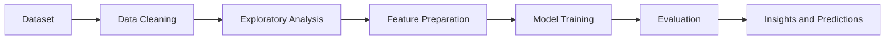

<div align="center">

# 🤖 Machine Learning Projects

### 📊 A Hands-On Portfolio of Applied Machine Learning

*Eight end-to-end projects across finance, healthcare, retail and telecom, from raw data to predictions.*

<br>


<br>


<br><br>

[🔗 Repository](https://github.com/vishal945vr/Machine-Learning-project) · [👤 Author](#-author)

</div>

---

## 📋 At a Glance

| | |
| :--- | :--- |
| 🎯 **Purpose** | Practise and showcase applied machine learning on real-world problems |
| 📁 **Projects** | 8 independent projects, one per folder or notebook |
| 🧪 **Problem types** | Regression, classification and clustering |
| 🏭 **Domains** | Finance, healthcare, insurance, retail, telecom, fitness |
| 🛠️ **Format** | Jupyter notebooks with data exploration, modelling and evaluation |

## 🔎 Overview

This repository collects machine learning projects built to understand how data becomes decisions. Each project takes a real-world style dataset, explores and cleans it, trains models, and evaluates how well they predict or group the data.

Together they cover the three core families of machine learning: predicting numbers (regression), predicting categories (classification), and finding hidden groups (clustering).

## 🗂️ Projects

| # | Project | Domain | Problem type | Goal |
| :---: | --- | :---: | :---: | --- |
| 1 | [🪙 Bitcoin](./Bitcoin) | 💹 Finance | 📈 Prediction | Analyse and predict Bitcoin price movement |
| 2 | [🔥 Calories Burn](./Calories_burn%20project) | 🏃 Fitness | 📈 Regression | Estimate calories burned from activity data |
| 3 | [🛍️ Customer Segmentation](./Customer_Segmentation) | 🛒 Retail | 🧩 Clustering | Group customers by behaviour for targeting |
| 4 | [🥇 Gold Price Prediction](./Gold_Price_Prediction) | 💹 Finance | 📈 Regression | Forecast gold prices from market indicators |
| 5 | [🏥 Insurance](./Insurance) | 🛡️ Insurance | 📈 Regression | Estimate insurance cost from customer details |
| 6 | [❤️ Heart Disease](./heart_disease_data) | 🩺 Healthcare | ✅ Classification | Predict the presence of heart disease |
| 7 | [💳 Credit Card](./CreditCard.ipynb) | 🏦 Banking | ✅ Classification | Detect risky or fraudulent card activity |
| 8 | [📞 Telco Customer Churn](./Telco_Customer_Churn.zip) | 📡 Telecom | ✅ Classification | Predict which customers will leave |

> [!NOTE]
> Project goals above are summarised from the project names. Update any row to match the exact dataset, target and results in each notebook.

## 🧭 Machine Learning Workflow

Every project follows the same practical pipeline.



## 🧪 Problem Types Covered

| Type | What it does | Projects |
| --- | --- | --- |
| 📈 **Regression** | Predicts a number | Gold Price, Insurance, Calories Burn, Bitcoin |
| ✅ **Classification** | Predicts a category | Heart Disease, Credit Card, Telco Churn |
| 🧩 **Clustering** | Finds natural groups | Customer Segmentation |

## 🧰 Technology Overview

| Category | Technology |
| --- | --- |
| 🐍 Language | Python |
| 📓 Environment | Jupyter Notebook |
| 🧮 Data handling | Pandas, NumPy |
| 🤖 Modelling | scikit-learn |
| 📉 Visualisation | Matplotlib, Seaborn |

## 📁 Repository Structure

```
Machine-Learning-project/
├── Bitcoin/                   # 🪙 Price analysis and prediction
├── Calories_burn project/     # 🔥 Calories burned regression
├── Customer_Segmentation/     # 🛍️ Customer clustering
├── Gold_Price_Prediction/     # 🥇 Gold price forecasting
├── Insurance/                 # 🏥 Insurance cost prediction
├── heart_disease_data/        # ❤️ Heart disease classification
├── CreditCard.ipynb           # 💳 Credit card analysis
├── Telco_Customer_Churn.zip   # 📞 Churn dataset and project
└── README.md
```

## ⚡ Getting Started

```bash
git clone https://github.com/vishal945vr/Machine-Learning-project.git
cd Machine-Learning-project
python -m pip install pandas numpy scikit-learn matplotlib seaborn jupyter
jupyter notebook
```

Open any project folder or notebook and run the cells from top to bottom.

> [!TIP]
> `Telco_Customer_Churn.zip` must be extracted before opening its notebook.

## 💼 Skills Demonstrated

| Area | Demonstrated through |
| --- | --- |
| 🧹 Data preparation | Cleaning, handling missing values, encoding features |
| 🔍 Exploratory analysis | Visualising patterns and relationships in data |
| 🤖 Model building | Regression, classification and clustering models |
| 📏 Evaluation | Measuring model performance with suitable metrics |
| 🏭 Domain variety | Finance, healthcare, retail, telecom and insurance data |

## 📈 Future Improvements

- [ ] 📝 Add a README to each project with dataset source and results
- [ ] 📊 Add a results table with metrics for every model
- [ ] 🔧 Try hyperparameter tuning and cross-validation
- [ ] 🌐 Deploy the best models as web apps
- [ ] 📦 Add a `requirements.txt` for one-step setup

## ⚠️ Disclaimer

These projects are for learning and portfolio purposes. Predictions, especially for financial and medical data, are not professional advice.

## 👤 Author

**Vishal Rajput**
🎓 BCA Student | 🤖 AI & Cloud Engineering

[](https://github.com/vishal945vr)

<div align="center">

⭐ If you find these projects useful, consider giving the repository a star.

</div>
